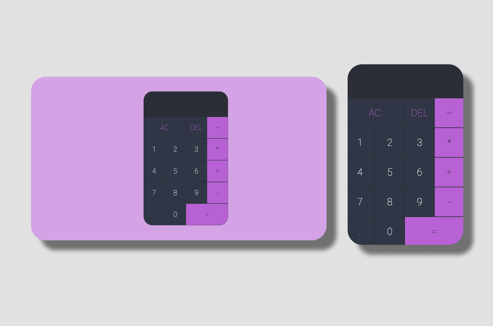

# React Calculator App

This is a simple calculator app built with React using the `useReducer` hook.
This is a code along project built to practice and learn the usage of the `useReducer` hook.

## Features

- Add, subtract, multiply, and divide operations
- Clear input
- Delete last digit

## Getting Started

To run this app locally, follow these steps:

1. Clone this repository to your local machine.
2. Navigate to the project directory.
3. Install dependencies using `npm install`.
4. Start the development server using `npm start`.
5. Open your browser and visit `http://localhost:3000` to view the app.

## Code Overview

The main logic of the calculator is implemented in `App.js` using a `reducer` function and the `useReducer` hook. Here's a brief overview of the code structure:

- `ACTIONS`: Defines action types for adding digits, choosing operations, clearing, deleting digits, and evaluating.
- `reducer`: Handles state updates based on dispatched actions, including adding digits, choosing operations, clearing, deleting digits, and evaluating expressions.
- `evaluate`: Utility function to perform arithmetic operations based on the selected operation.
- `formatOperand`: Utility function to format operands for display in the calculator.
- `DigitButton` and `OperationButton` components: Render buttons for digits and operations, respectively, and dispatch corresponding actions when clicked.

## Dependencies

- React
- React DOM
- CSS (styles are defined in `App.css`)

## Contributing

Contributions are welcome! If you have any suggestions or improvements, feel free to open an issue or submit a pull request.
